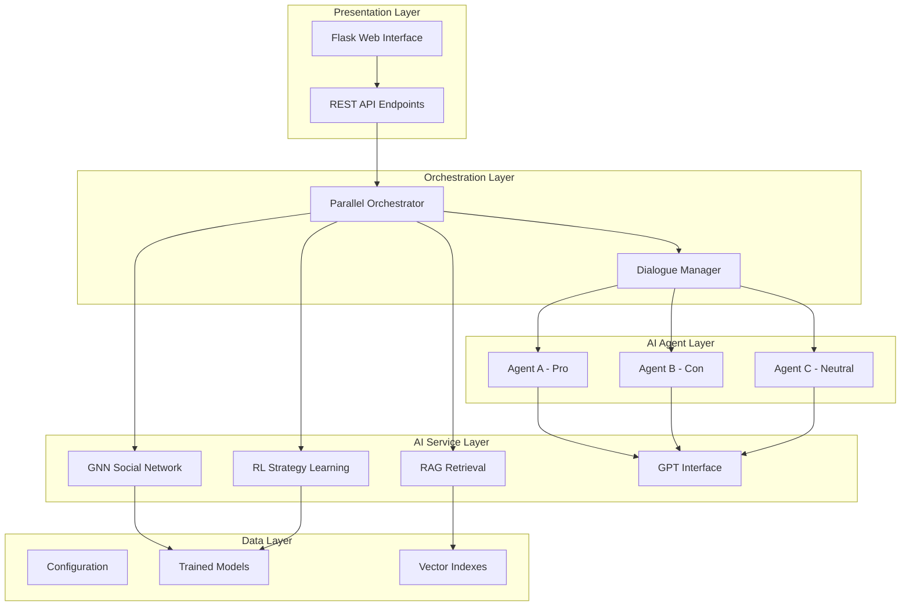
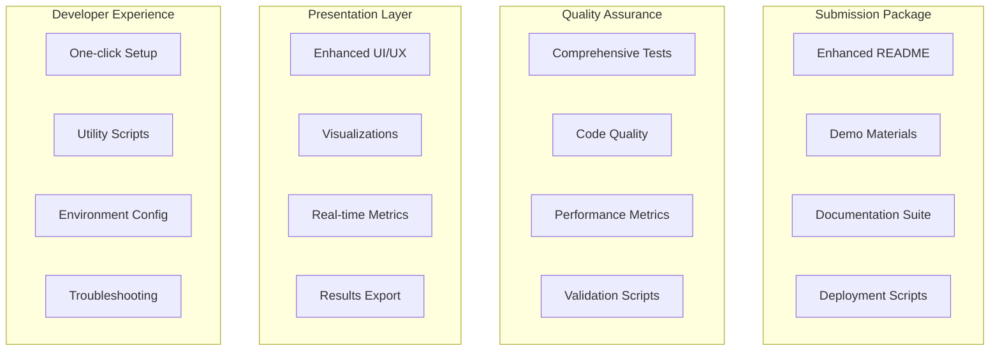

# Design Document

## Overview

The hackathon submission preparation involves creating a comprehensive polish and presentation layer for the Desi Debate AI project. The system is already functionally complete with advanced AI components (RAG, GNN, RL) and a working web interface. The design focuses on enhancing presentation, documentation, deployment readiness, and demonstration capabilities to create a compelling hackathon submission.

## Architecture

### Current System Architecture
The project already has a robust multi-layered architecture:



### Enhancement Architecture for Hackathon Submission



## Components and Interfaces

### 1. Documentation Enhancement Component

**Purpose**: Create comprehensive, professional documentation that showcases the project's technical depth and usability.

**Interfaces**:
- `README.md` - Main project documentation with clear value proposition
- `DEMO.md` - Step-by-step demonstration guide with screenshots
- `ARCHITECTURE.md` - Technical architecture deep-dive
- `API_DOCS.md` - Complete API documentation with examples

**Key Features**:
- Visual diagrams using Mermaid
- Code examples and usage patterns
- Performance benchmarks and metrics
- Clear installation and setup instructions

### 2. User Experience Enhancement Component

**Purpose**: Polish the web interface to create an impressive, intuitive demonstration experience.

**Interfaces**:
- Enhanced HTML templates with modern styling
- Real-time debate visualization
- Interactive agent state displays
- Results export and sharing capabilities

**Key Features**:
- Responsive design for all screen sizes
- Real-time updates during debates
- Visual representation of agent emotions/stances
- Debate history and analytics

### 3. Deployment Readiness Component

**Purpose**: Ensure the project can be easily deployed and demonstrated in various environments.

**Interfaces**:
- `docker-compose.yml` - Containerized deployment
- `deploy.sh` - One-click deployment script
- `requirements-prod.txt` - Production dependencies
- Environment validation scripts

**Key Features**:
- Docker containerization for consistent deployment
- Cloud deployment configurations (Heroku, AWS, etc.)
- Environment-specific configurations
- Health check endpoints

### 4. Quality Assurance Component

**Purpose**: Demonstrate code quality, testing coverage, and system reliability.

**Interfaces**:
- Comprehensive test suite with coverage reports
- Code quality metrics and linting
- Performance benchmarking scripts
- Automated validation pipelines

**Key Features**:
- Unit tests for all major components
- Integration tests for end-to-end workflows
- Performance profiling and optimization
- Code quality badges and metrics

### 5. Demonstration Materials Component

**Purpose**: Create compelling demonstration materials that highlight the project's innovation and technical achievements.

**Interfaces**:
- Video demonstration script
- Interactive demo scenarios
- Benchmark comparisons
- Technical presentation slides

**Key Features**:
- Pre-configured demo scenarios
- Performance comparison data
- Technical innovation highlights
- Clear value proposition presentation

## Data Models

### Project Metadata Model
```python
class ProjectMetadata:
    name: str = "Desi Debate"
    version: str = "1.0.0"
    description: str = "AI-powered multi-agent debate system"
    technologies: List[str] = ["RAG", "GNN", "RL", "Flask", "PyTorch"]
    features: List[str] = ["Multi-agent debates", "Real-time visualization", "AI strategy learning"]
    performance_metrics: Dict[str, float]
    demo_scenarios: List[DemoScenario]
```

### Demo Scenario Model
```python
class DemoScenario:
    title: str
    description: str
    topic: str
    expected_duration: int  # seconds
    key_features_demonstrated: List[str]
    setup_instructions: List[str]
    success_criteria: List[str]
```

### Deployment Configuration Model
```python
class DeploymentConfig:
    environment: str  # "development", "staging", "production"
    required_env_vars: List[str]
    optional_features: Dict[str, bool]
    resource_requirements: ResourceRequirements
    health_check_endpoints: List[str]
```

## Error Handling

### Documentation Errors
- **Missing Files**: Automated detection of missing documentation files
- **Broken Links**: Link validation in all documentation
- **Outdated Content**: Version consistency checks across documents

### Deployment Errors
- **Environment Issues**: Comprehensive environment validation
- **Dependency Conflicts**: Automated dependency resolution
- **Configuration Errors**: Configuration validation with helpful error messages

### Demo Failures
- **API Unavailability**: Graceful fallback to offline demo mode
- **Performance Issues**: Resource monitoring and optimization suggestions
- **User Interface Errors**: Comprehensive error boundaries with recovery options

## Testing Strategy

### 1. Documentation Testing
- **Link Validation**: Automated checking of all documentation links
- **Code Example Testing**: Validation that all code examples work
- **Installation Testing**: Automated testing of setup instructions on clean environments

### 2. User Experience Testing
- **Cross-browser Testing**: Ensure web interface works across major browsers
- **Responsive Design Testing**: Validate mobile and desktop experiences
- **Accessibility Testing**: Ensure compliance with accessibility standards

### 3. Deployment Testing
- **Environment Testing**: Validate deployment on multiple platforms
- **Performance Testing**: Load testing and performance benchmarking
- **Integration Testing**: End-to-end workflow validation

### 4. Demo Scenario Testing
- **Scenario Validation**: Ensure all demo scenarios work reliably
- **Timing Validation**: Verify demo scenarios complete within expected timeframes
- **Feature Coverage**: Ensure all key features are demonstrated

## Implementation Phases

### Phase 1: Documentation Polish
- Enhance README with compelling project description
- Create comprehensive API documentation
- Add architecture diagrams and technical deep-dive
- Create step-by-step demo guide

### Phase 2: User Experience Enhancement
- Polish web interface styling and responsiveness
- Add real-time visualizations and metrics
- Implement results export functionality
- Create interactive demo scenarios

### Phase 3: Deployment Readiness
- Create Docker containerization
- Add one-click deployment scripts
- Implement comprehensive environment validation
- Create cloud deployment configurations

### Phase 4: Quality Assurance
- Expand test coverage across all components
- Implement automated code quality checks
- Create performance benchmarking suite
- Add comprehensive error handling

### Phase 5: Demonstration Materials
- Create video demonstration materials
- Develop interactive presentation
- Compile performance metrics and comparisons
- Create judge evaluation materials

## Success Metrics

### Technical Metrics
- **Test Coverage**: >90% code coverage
- **Performance**: <2s response time for debate interactions
- **Reliability**: >99% uptime during demonstrations
- **Code Quality**: A-grade code quality scores

### User Experience Metrics
- **Setup Time**: <5 minutes from clone to running
- **Demo Completion**: <10 minutes for full feature demonstration
- **Error Rate**: <1% user-facing errors during normal operation
- **Accessibility**: WCAG 2.1 AA compliance

### Presentation Metrics
- **Documentation Completeness**: All major features documented with examples
- **Visual Appeal**: Professional, modern interface design
- **Technical Depth**: Clear demonstration of AI/ML innovations
- **Differentiation**: Clear value proposition vs. existing solutions