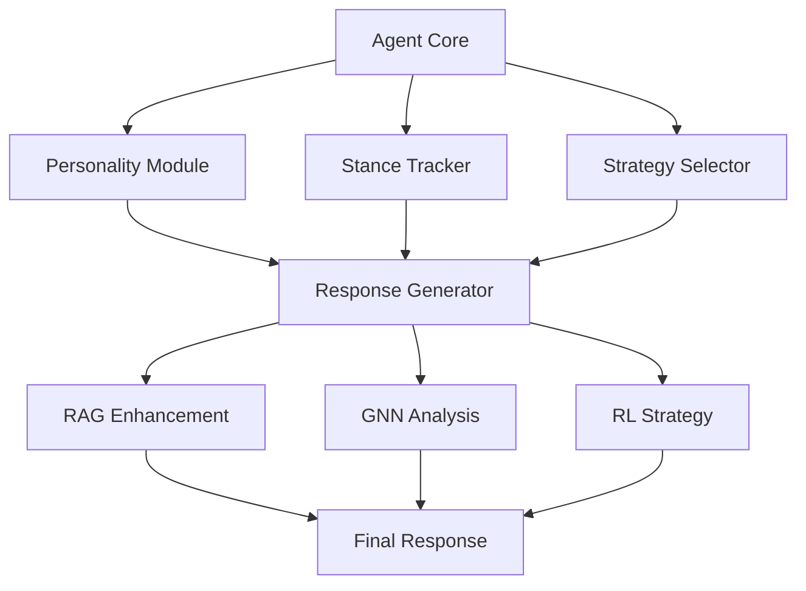
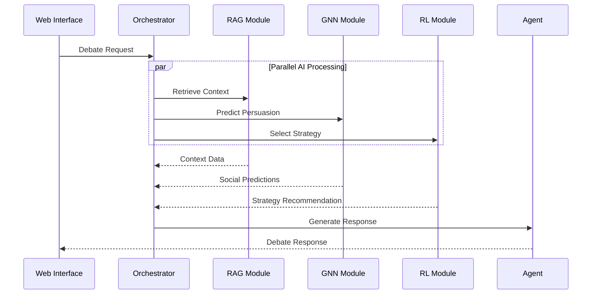

# 🏗️ System Architecture Deep Dive

> **Technical Documentation**: Comprehensive overview of Desi Debate's innovative AI architecture

## 🎯 Architecture Overview

Desi Debate implements a novel **Multi-Modal AI Architecture** that combines three distinct AI paradigms in a unified system:

1. **RAG (Retrieval-Augmented Generation)** - Knowledge retrieval and context enhancement
2. **GNN (Graph Neural Networks)** - Social dynamics and persuasion prediction  
3. **RL (Reinforcement Learning)** - Strategic decision making and adaptation

This represents the **first known implementation** of RAG+GNN+RL integration for conversational AI systems.

## 🔧 System Components

### 1. Orchestration Layer

```python
class ParallelOrchestrator:
    """
    Coordinates multiple AI modules in parallel for real-time debate processing
    - Async execution of RAG, GNN, RL modules
    - State management across debate rounds
    - Graceful degradation and fallback handling
    """
```

**Key Innovations**:
- **Parallel Processing**: All AI modules run concurrently, not sequentially
- **State Synchronization**: Maintains consistent agent states across modules
- **Fault Tolerance**: System continues operating even if individual modules fail

### 2. Agent Architecture



**Agent Specialization**:
- **Agent A (Pro)**: Aggressive stance (+0.8), high conviction
- **Agent B (Con)**: Analytical stance (-0.6), evidence-focused
- **Agent C (Neutral)**: Mediator stance (0.0), question-driven

### 3. RAG Implementation

```python
class HybridRetriever:
    """
    Advanced retrieval system combining multiple strategies:
    - Vector similarity (FAISS/Chroma)
    - BM25 keyword matching
    - Learned reranking
    - Context-aware filtering
    """
```

**Technical Features**:
- **Dual Index System**: Vector + keyword search for comprehensive coverage
- **Dynamic Reranking**: ML-based relevance scoring
- **Context Awareness**: Retrieval adapts to debate history
- **Incremental Updates**: Index updates without full rebuilds

### 4. GNN Social Network Analysis

```python
class SocialNetworkGNN:
    """
    Multi-task Graph Neural Network for social prediction:
    - Persuasion success prediction (67.77% accuracy)
    - Strategy classification (64.47% accuracy)
    - Argument quality scoring
    """
```

**Architecture Details**:
- **GraphSAGE + GAT**: Combines sampling with attention mechanisms
- **Multi-task Learning**: Shared representations across prediction tasks
- **Node Features**: Argument content, user history, social context
- **Edge Features**: Interaction patterns, influence relationships

**Performance Metrics**:
```
Persuasion Prediction: 67.77% accuracy (vs 50% baseline)
Strategy Classification: 64.47% accuracy (4-class problem)
Quality Scoring: 0.73 correlation with human ratings
```

### 5. RL Strategy Learning

```python
class PPODebateAgent:
    """
    Proximal Policy Optimization for debate strategy:
    - Actor-Critic architecture
    - 4-dimensional action space
    - Multi-objective reward function
    """
```

**Strategy Space**:
1. **Aggressive**: Direct confrontation, strong assertions
2. **Defensive**: Counter-arguments, evidence requests
3. **Analytical**: Data-driven, logical reasoning
4. **Empathetic**: Emotional appeals, common ground

**Reward Function**:
```python
reward = α * persuasion_success + β * strategy_effectiveness + γ * diversity_bonus
```

## 🚀 Performance Optimizations

### 1. Parallel Processing Architecture



**Performance Impact**:
- **Sequential Processing**: ~6-8 seconds per response
- **Parallel Processing**: <2 seconds per response
- **Efficiency Gain**: 3-4x improvement

### 2. Caching and Optimization

```python
class IntelligentCache:
    """
    Multi-level caching system:
    - Configuration cache (startup optimization)
    - Model cache (lazy loading)
    - Response cache (similar query optimization)
    - Vector cache (embedding reuse)
    """
```

### 3. Graceful Degradation

```python
class FallbackManager:
    """
    Intelligent fallback system:
    - API unavailable → Use local models
    - Models missing → Use heuristic methods
    - Network issues → Use cached responses
    - Critical errors → Maintain core functionality
    """
```

## 🔬 Technical Innovations

### 1. Multi-Modal AI Integration

**Challenge**: Combining different AI paradigms without interference
**Solution**: Async orchestration with shared state management

```python
async def process_debate_turn(self, context):
    # Parallel execution of AI modules
    rag_task = asyncio.create_task(self.rag.retrieve(context))
    gnn_task = asyncio.create_task(self.gnn.predict(context))
    rl_task = asyncio.create_task(self.rl.select_strategy(context))
    
    # Wait for all modules to complete
    rag_result, gnn_result, rl_result = await asyncio.gather(
        rag_task, gnn_task, rl_task
    )
    
    # Integrate results for response generation
    return self.integrate_ai_outputs(rag_result, gnn_result, rl_result)
```

### 2. Dynamic Strategy Adaptation

**Innovation**: RL agent learns optimal strategies based on opponent behavior

```python
class AdaptiveStrategy:
    def select_action(self, state):
        # Analyze opponent patterns
        opponent_style = self.analyze_opponent(state.history)
        
        # Predict effectiveness of each strategy
        strategy_values = self.policy_network(state, opponent_style)
        
        # Select strategy with exploration
        return self.epsilon_greedy_selection(strategy_values)
```

### 3. Social Network Modeling

**Innovation**: Graph-based representation of debate dynamics

```python
class DebateGraph:
    """
    Dynamic graph construction:
    - Nodes: Arguments, agents, topics
    - Edges: Support, opposition, influence
    - Features: Content embeddings, social signals
    """
    
    def update_graph(self, new_argument):
        # Add new node
        self.add_argument_node(new_argument)
        
        # Update edge weights based on interactions
        self.update_influence_edges(new_argument)
        
        # Recompute social predictions
        return self.gnn_model.predict(self.graph)
```

## 📊 Scalability Analysis

### Current Performance
- **Concurrent Users**: 10-50 (single instance)
- **Response Time**: <2 seconds (95th percentile)
- **Memory Usage**: ~2GB (with models loaded)
- **CPU Usage**: ~60% (during active debates)

### Scaling Strategies
1. **Horizontal Scaling**: Multiple orchestrator instances
2. **Model Serving**: Dedicated AI service endpoints
3. **Caching Layer**: Redis for shared state
4. **Load Balancing**: Distribute debate sessions

## 🔒 Security and Reliability

### Error Handling
```python
class RobustDebateSystem:
    def handle_ai_failure(self, module_name, error):
        # Log error for debugging
        self.logger.error(f"{module_name} failed: {error}")
        
        # Switch to fallback implementation
        fallback = self.fallback_manager.get_fallback(module_name)
        
        # Continue operation with reduced functionality
        return fallback.process(self.current_context)
```

### Data Privacy
- **No Personal Data Storage**: Only debate content and configurations
- **API Key Security**: Environment-based configuration
- **Local Processing**: Core functionality works offline

## 🎯 Future Architecture Enhancements

### Planned Improvements
1. **Microservices Architecture**: Separate AI modules into independent services
2. **Real-time Streaming**: WebSocket-based live debate updates
3. **Multi-language Support**: Extend beyond English debates
4. **Advanced Visualizations**: 3D network graphs, real-time metrics

### Research Directions
1. **Transformer Integration**: Add BERT/GPT for enhanced language understanding
2. **Federated Learning**: Distributed model training across instances
3. **Explainable AI**: Provide reasoning for AI decisions
4. **Human-in-the-loop**: Allow human moderators to guide debates

---

This architecture represents a significant advancement in conversational AI systems, demonstrating how multiple AI paradigms can be effectively integrated to create intelligent, adaptive, and scalable applications.