# 🎭 Desi Debate: AI-Powered Multi-Agent Debate System

> **🏆 Hackathon Project**: An innovative AI system that simulates realistic debates using cutting-edge machine learning technologies

**Desi Debate** is a sophisticated multi-agent AI system that creates dynamic, intelligent debates by combining three advanced AI technologies: **Retrieval-Augmented Generation (RAG)**, **Graph Neural Networks (GNN)**, and **Reinforcement Learning (RL)**. Watch as three distinct AI agents engage in compelling debates, learning and adapting their strategies in real-time.


## 🚀 Quick Demo

**Try it in 3 steps:**
1. `git clone [repository-url] && cd Desi_Debate`
2. `python install_dependencies.py && python setup_environment.py`
3. `python run_flask.py` → Visit http://localhost:5000

**No API key?** No problem! The system works with intelligent fallbacks for immediate demonstration.

## Key Features

- **Multi-Agent Debate** - 3 AI Agents with different stances and personalities engage in dynamic debates
- **RAG Enhancement** - Based on FAISS/Chroma vector databases, supporting hybrid retrieval and reranking
- **GNN Social Network** - Supervised learning to predict persuasion success rate with multi-task learning architecture
- **RL Strategy Learning** - PPO reinforcement learning with real environment interaction and 4 dynamic debate strategies
- **Web Interface** - Modern Flask + Bootstrap 5 responsive interface
- **Parallel Processing** - Asynchronous architecture with three modules analyzing in parallel

## 🎯 What Makes This Special

### 🧠 Advanced AI Integration
- **First-of-its-kind** combination of RAG, GNN, and RL in a single debate system
- **Real-time learning** agents that adapt their strategies during debates
- **Social network analysis** to predict persuasion outcomes with 67.77% accuracy

### 🚀 Technical Innovation
- **Parallel AI processing** with async orchestration for sub-2-second response times
- **Graceful degradation** - works even without API keys using intelligent fallbacks
- **Multi-task learning** architecture handling classification, regression, and strategy optimization simultaneously

### 💡 Practical Impact
- **Educational tool** for understanding argumentation and persuasion
- **Research platform** for studying AI-human interaction patterns
- **Demonstration** of how multiple AI technologies can work together seamlessly

## System Architecture

```mermaid
flowchart TD
    UI[🌐 Web Interface] --> O[⚡ Orchestrator]
    O --> DM[🎭 Dialogue Manager]
    
    O --> RAG[📚 RAG<br/>Retrieval Augmented]
    O --> GNN[🔗 GNN<br/>Social Network]
    O --> RL[🎮 RL<br/>Strategy Learning]
    
    DM --> A[🔴 Agent A<br/>Pro]
    DM --> B[🟢 Agent B<br/>Con]
    DM --> C[🟡 Agent C<br/>Neutral]
    
    RAG -.-> DM
    GNN -.-> DM
    RL -.-> DM
    
    style UI fill:#FFE4E1
    style O fill:#F0E68C
    style DM fill:#F0E68C
    style RAG fill:#E0FFFF
    style GNN fill:#E0FFFF
    style RL fill:#E0FFFF
    style A fill:#FFB6C1
    style B fill:#90EE90
    style C fill:#FFFFE0
```



## Quick Start

### Requirements
- Python 3.8+
- CUDA 11.8+ (optional, for GPU acceleration)
- 8GB+ RAM
- OpenAI API Key (for RAG embeddings)

### Installation

```bash
# 1. Clone the project
git clone https://github.com/your-username/Desi_Debate.git
cd Desi_Debate

# 2. Create virtual environment (recommended)
python -m venv venv
# Windows:
venv\Scripts\activate
# Linux/Mac:
source venv/bin/activate

# 3. Install dependencies
python install_dependencies.py
# OR manually:
pip install -r requirements.txt

# 4. Setup environment
python setup_environment.py
# This will guide you through configuration

# 5. Set your OpenAI API key
cp .env.example .env
# Edit .env file and add: OPENAI_API_KEY=your-api-key-here

# 6. Test the system
python test_basic_functionality.py
```

### Quick Run

```bash
# Method 1: Use startup script
# Windows
scripts\start_flask.bat

# Linux/Mac
./scripts/start_flask.sh

# Method 2: Direct run
python run_flask.py
```

Visit http://localhost:5000 to start using!

## Training Models

### Train All Models
```bash
python train_all.py --all
```

### Individual Training
```bash
# Train GNN social network model
python train_all.py --gnn

# Train RL strategy model
python train_all.py --rl

# Build RAG index
python train_all.py --rag        # Simple index
python train_all.py --rag-chroma  # Chroma vector index
```

For detailed training guide, see [docs/TRAINING_GUIDE.md](docs/TRAINING_GUIDE.md)

## 📊 Performance Metrics

| Component | Metric | Performance | Benchmark |
|-----------|--------|-------------|-----------|
| **GNN Model** | Persuasion Prediction | **67.77%** accuracy | State-of-the-art social prediction |
| **GNN Model** | Strategy Classification | **64.47%** accuracy | Multi-class strategy recognition |
| **Response Time** | End-to-end Debate Turn | **<2 seconds** | Real-time interaction |
| **System Reliability** | Uptime During Demo | **>99%** | Production-ready stability |
| **Fallback Coverage** | No-API-Key Mode | **100%** functional | Graceful degradation |

## Technical Details

### RAG System
- **Vector Database**: FAISS + Chroma
- **Embedding Model**: BERT/Sentence-BERT
- **Retrieval Strategy**: Hybrid retrieval (Vector + BM25) + Learned reranking
- **Features**: Batch processing, incremental updates, context-aware retrieval
- **Optimizations**: IVF indexing, GPU acceleration, query caching

### GNN Model
- **Algorithm**: Supervised learning (GraphSAGE + GAT)
- **Task Type**: Multi-task learning
  - Delta prediction (binary classification)
  - Quality scoring (regression)
  - Strategy classification (multi-class)
- **Architecture**: 3-layer GraphSAGE + GAT attention mechanism
- **Performance**: Delta accuracy 67.77%, Strategy accuracy 64.47%
- **Integration**: Predict persuasion success rate, recommend optimal strategies

### RL Model
- **Algorithm**: PPO (Proximal Policy Optimization)
- **Network**: Actor-Critic dual networks
- **Action Space**: 4 strategies (aggressive, defensive, analytical, empathetic)
- **Reward Design**: 
  - Strategy effectiveness reward
  - Persuasion success reward
  - Strategy diversity reward
- **Environment**: Real debate environment simulation with state transitions and termination conditions

### Debate Mechanism
- **Surrender Conditions**: 
  - High persuasion (>0.6) + Low belief (<0.4)
  - Near-neutral stance (<0.2) + Lower belief (<0.5)
  - Highly persuaded for 3 consecutive rounds (>0.5)
- **Victory Determination**: Comprehensive consideration of stance firmness, persuasion ability, and resistance

## Project Structure

```
Desi_Debate/
├── ui/                    # Flask Web Application
│   ├── app.py            # Backend API
│   ├── templates/        # HTML Templates
│   └── static/          # CSS/JS Resources
├── src/                  # Core Modules
│   ├── agents/          # Agent Implementation
│   ├── rag/             # RAG Retrieval System
│   ├── gnn/             # GNN Social Network
│   ├── rl/              # RL Strategy Learning
│   ├── orchestrator/    # Debate Orchestrator
│   ├── dialogue/        # Dialogue Management
│   └── gpt_interface/   # GPT Interface
├── data/                 # Data Directory
│   ├── raw/             # Raw Data
│   ├── models/          # Trained Models
│   ├── chroma/          # Vector Index
│   └── rl/              # RL Training Data
├── configs/              # Configuration Files
├── scripts/              # Startup Scripts
├── docs/                 # Detailed Documentation
└── tests/                # Test Suite
```

## Documentation

### User Guides
- [Quick Start Guide](docs/QUICKSTART.md) - 5-minute tutorial
- [Training Guide](docs/TRAINING_GUIDE.md) - Complete model training instructions
- [Configuration Guide](docs/CONFIGURATION_GUIDE.md) - Detailed system configuration
- [Debate Scoring System](docs/DEBATE_SCORING_SYSTEM.md) - Victory determination mechanism

### Technical Documentation
- [API Reference](docs/API_REFERENCE.md) - Flask API interface documentation
- [Deployment Guide](docs/DEPLOYMENT.md) - Production deployment instructions

### Module Documentation
- [GNN Module](docs/GNN_MODULE.md) - Graph Neural Network detailed documentation
- [RL Module](docs/RL_MODULE.md) - Reinforcement Learning detailed documentation
- [RAG Module](docs/RAG_MODULE.md) - Retrieval Augmented Generation detailed documentation

## Usage Examples

### 1. Set Debate Topic
Enter your discussion topic in the Web UI, for example:
- "Should artificial intelligence be regulated by government?"
- "Is universal basic income feasible?"
- "Is social media's impact on society positive or negative?"

### 2. Observe Debate Process
- Agent A (Red): Aggressive pro side, stance +0.8
- Agent B (Green): Rational con side, stance -0.6
- Agent C (Yellow): Neutral observer, stance 0.0

### 3. Analyze Debate Results
The system automatically:
- Evaluates persuasiveness, aggressiveness, and evidence strength of each statement
- Updates agents' stances and beliefs
- Determines if any agent has been persuaded to surrender
- Provides final victory determination and detailed analysis

## Configuration

Main configuration files are located in the `configs/` directory:

- `debate.yaml` - Debate parameter configuration
- `rag.yaml` - RAG system configuration
- `gnn.yaml` - GNN model configuration
- `rl.yaml` - RL training configuration

## Dataset

This project uses the Reddit ChangeMyView dataset:

[](https://doi.org/10.5281/zenodo.3778297)

**Dataset Features**:
- 10,303 debate topics
- 17,716 successful persuasion cases
- 18,561 unsuccessful persuasion cases
- Rich metadata annotations

## Contributing

We welcome code contributions, issue reports, and suggestions!

1. Fork this project
2. Create your feature branch (`git checkout -b feature/AmazingFeature`)
3. Commit your changes (`git commit -m 'Add some AmazingFeature'`)
4. Push to the branch (`git push origin feature/AmazingFeature`)
5. Open a Pull Request

## License

This project is licensed under the MIT License - see the [LICENSE](LICENSE) file for details

## Acknowledgments

- Reddit ChangeMyView community for providing high-quality dataset
- PyTorch team for the deep learning framework
- LangChain team for RAG toolchain
- All contributors and users for their support

